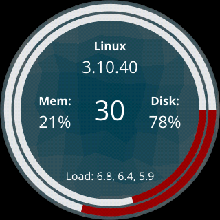

===============================================================================
Asteroid Top
===============================================================================

Asteroid Top is an app for `AsteroidOS <https://asteroidos.org>`_ written in
Go. It displays the Linux kernel version, CPU load, memory usage, disk usage,
and load averages (1,5,15 min). This app is mean to serve as an example of
writing Go apps for AsteroidOS.

-------------------------------------------------------------------------------
Building from source
-------------------------------------------------------------------------------

*These instructions assume you're running Linux*

1. Install Go >= 1.13 and setup a proper `GOPATH <https://golang.org/doc/code.html#GOPATH>`_ 

3. Install `Asteroid SDK <https://asteroidos.org/wiki/creating-an-asteroid-app/>`_

4. Install the Qt bindings from github.com/therecipe/qt.

5. Setup the Qt bindings for asteroid. 

   $ qtsetup full asteroid

5. Clone asteroid-top and download dependencies::

    $ git clone https://github.com/aebruno/asteroid-top.git
    $ cd asteroid-top
    $ go get github.com/shirou/gopsutil 
    $ ./build.sh prep

8. Build the armv7ve binary for Asteroid::

    $ qtdeploy build asteroid

9. Install the app on the watch::

    $ adb push /deploy/asteroid/asteroid-top /usr/bin/
    $ adb push asteroid-top.desktop /usr/share/applications/

-------------------------------------------------------------------------------
License
-------------------------------------------------------------------------------

Copyright (C) 2017 Andrew E. Bruno

asteroid-top is free software: you can redistribute it and/or modify it under the
terms of the GNU General Public License as published by the Free Software
Foundation, either version 3 of the License, or (at your option) any later
version.

This program is distributed in the hope that it will be useful, but WITHOUT ANY
WARRANTY; without even the implied warranty of MERCHANTABILITY or FITNESS FOR A
PARTICULAR PURPOSE. See the GNU General Public License for more details.

You should have received a copy of the GNU General Public License along with
this program. If not, see <http://www.gnu.org/licenses/>.
